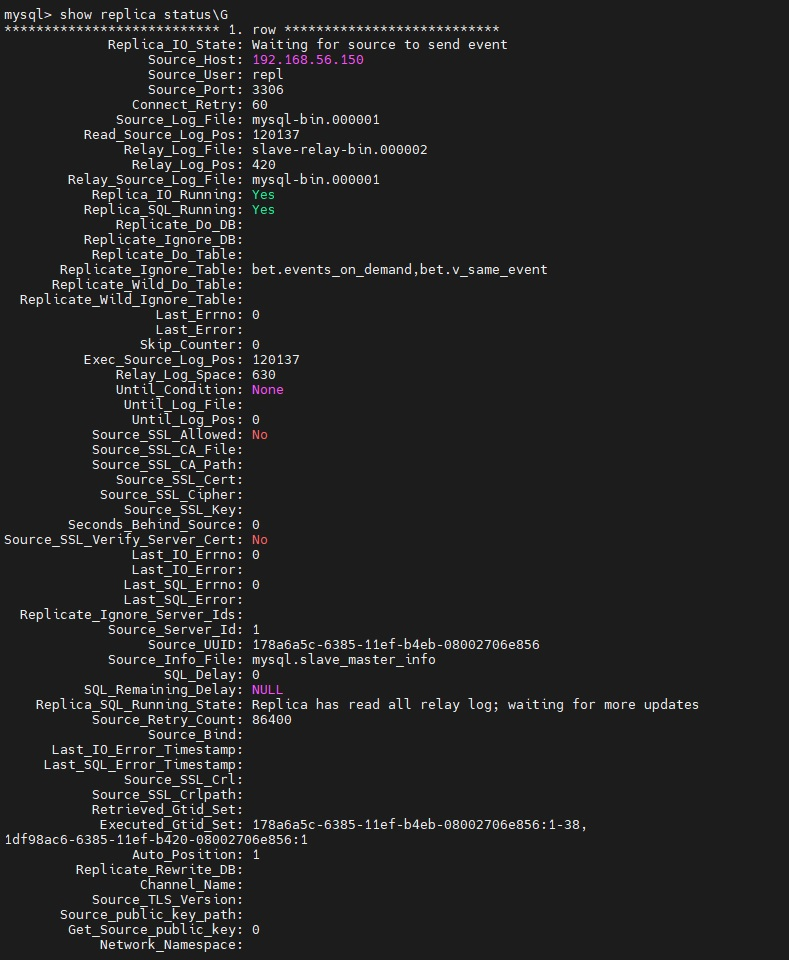
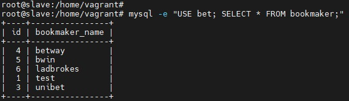

# Otus Homework 27. MySQL.
### Цель домашнего задания
Поработать с репликацией MySQL.
### Описание домашнего задания
Развернуть базу на мастере и настроить репликацию так, чтобы реплицировались таблицы:
- bookmaker
- competition
- market
- odds
- outcome

Настроить GTID репликацию
## Выполнение
С помощью _vagrant_ развернем тестовый стенд:
|Имя|IP-адрес|ОС|
|-|-|-|
|master|192.168.56.150|Ubuntu 22.04|
|slave|192.168.56.151|Ubuntu 22.04|

Установим _Percona Server_:
```bash
curl -O https://repo.percona.com/apt/percona-release_latest.generic_all.deb
sudo apt install gnupg2 lsb-release ./percona-release_latest.generic_all.deb
sudo apt update
sudo percona-release setup ps80
sudo apt install percona-server-server
```
Скопируем конфигурационные файлы в каталог _/etc/mysql/mysql.conf.d/_ и перезапустим службу:
```bash
systemctl restart mysql
```
#### 01-base.cnf
```
[mysqld]
pid-file=/var/run/mysqld/mysqld.pid
log-error=/var/log/mysql/mysqld.log
datadir=/var/lib/mysql
socket=/var/run/mysqld/mysqld.sock
symbolic-links=0
server-id = 1
innodb_file_per_table = 1
skip-name-resolve
```
#### 02-max-connections.cnf
```
[mysqld]
wait-timeout = 60
max-connections = 500
```
#### 03-performance.cnf
```
[mysqld]
skip-external-locking
key-buffer-size = 384M
max-allowed-packet = 16M
table-open-cache = 5000
sort-buffer-size = 64M
join-buffer-size = 64M
read-buffer-size = 2M
read-rnd-buffer-size = 8M
myisam-sort-buffer-size = 64M
thread-cache-size = 8
#query-cache-limit = 64M
#query-cache-size = 1024M
tmp-table-size = 1024M
max-heap-table-size = 1024M
```
#### 04-slow-query.cnf
```
[mysqld]
slow-query-log = 1
log-output = TABLE
long-query-time = 2
```
#### 05-binlog.cnf
```
[mysqld]
log-bin = mysql-bin
expire-logs-days = 7
max-binlog-size = 16M
binlog-format = "MIXED"

# GTID replication config
log-slave-updates = On
gtid-mode = On
enforce-gtid-consistency = On
```
На сервере **slave** необходимо указать значение _server-id_ равное 2, а также добавить строчки
```
replicate-ignore-table=bet.events_on_demand
replicate-ignore-table=bet.v_same_event
```
, чтобы исключить указанные таблицы из репликации.

Создадим базу _bet_
```
mysql> CREATE DATABASE bet;
Query OK, 1 row affected (0.00 sec)
```
И загрузим в нее дамп:
```bash
mysql -uroot -p -D bet < /vagrant/bet.dmp
```
Для настройки репликации необходимо создать пользователя и дать ему необходимые права:
```
mysql> CREATE USER 'repl'@'%' IDENTIFIED BY 'Qwerty123!!';
mysql> GRANT REPLICATION SLAVE ON *.* TO 'repl'@'%';
```
Повторно снимем дамп на **master** и загрузим его на **slave**^
```bash
mysqldump --all-databases --add-drop-table --create-options --disable-keys \
                       --extended-insert --single-transaction --quick --events --routines \
                       --triggers --source-data=0 --skip-lock-tables --flush-privileges \
                       --ignore-table=bet.events_on_demand --ignore-table=bet.v_same_event \
                       -u root -p Qwerty123! > /home/vagrant/master.sql
```
```bash
mysql < /home/vagrant/master.sql
```
Настроим и запустим репликацию на **slave** сервере:
```bash
CHANGE REPLICATION SOURCE TO SOURCE_HOST = '192.168.56.150', SOURCE_PORT = 3306, SOURCE_USER = 'repl', SOURCE_PASSWORD = 'Qwerty123!!', SOURCE_AUTO_POSITION = 1;
START REPLICA;
SHOW REPLICA STATUS\G
```
Репликация настроена успешно:

Внесем изменени на *master* и убедимся, что они успешно реплицируются на **slave**:
```
mysql> USE bet;
mysql> INSERT INTO bookmaker (id,bookmaker_name) VALUES(1,'test');
```


Для выполнения задания с помощью **ansible** небходимо запустить playbook:
```bash
ansible-playbook mysql.yml
```
